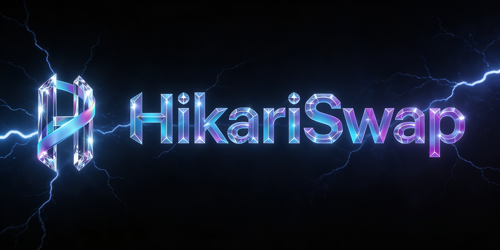

<p align="center">
  
</p>

<h1 align="center">HikariSwap</h1>

<p align="center">
  The first decentralized exchange on Lightchain.
</p>

<p align="center">
  <a href="https://hikariswap.com"></a>
  <a href="https://x.com/hikariswap"></a>
  <a href="mailto:hikari@hikariswap.com"></a>
  
  
  
</p>

---

## What is HikariSwap

HikariSwap is an automated market maker (AMM) and on-chain ERC20 launcher built natively for [Lightchain](https://lightchain.ai) (chain id `9200`, native asset `LCAI`). It is the first DEX deployed on the network.

The protocol provides four things in a single, audited stack:

1. **Token swaps** through a constant-product AMM, with the slippage, deadline, and multi-hop guarantees users expect from a Uniswap V2-style exchange.
2. **Liquidity provisioning** with deterministic LP token addresses, fee-on-transfer support, and permit-based zero-approval LP withdrawals.
3. **Token creation**, where any user can deploy one of four audited ERC20 archetypes by paying a small flat `LCAI` fee, with the resulting tokens immediately tradable on HikariSwap.
4. **Liquidity locking**, a trustless time-vault that lets token launchers prove their LP positions cannot be withdrawn before a public unlock date.

## Fee model

| Component | Rate | Routed to |
| --- | --- | --- |
| Liquidity provider fee | 0.25% | Pair LPs |
| Protocol fee | 0.10% | Treasury (Gnosis Safe post-launch) |
| **Total swap fee** | **0.35%** | |
| Token creation (any archetype) | 5,000 LCAI | Treasury |

Token creation pricing is owner-updatable within a hard `[1,000, 50,000]` LCAI range; the bounds are immutable.

## Token archetypes

Created via `HikariTokenFactory`. All four templates inherit from OpenZeppelin v5.1.0 audited primitives.

- **Standard** - fixed supply, no admin, no special mechanics.
- **Mintable** - `Ownable2Step`, immutable max-supply cap that can never be raised.
- **Burnable** - holder and allowance burn paths via `ERC20Burnable`.
- **Tax** - buy/sell tax with hard immutable caps (10% per side), default-excluded creator and treasury addresses.

Each token is deployed with `CREATE2` from a salt of `(creator, nonce, chainId)`, so the deployment address is predictable from the UI before signing.

## Architecture

```
+-----------------+       +-----------------+       +---------------------+
|  HikariFactory  +<----->+   HikariPair    +<----->+  HikariLPToken      |
+--------+--------+       +--------+--------+       +---------------------+
         |                         |
         v                         v
+-----------------+       +-----------------+
|  HikariRouter   +------>+  HikariLibrary  |
+-----------------+       +-----------------+

+----------------------+       +-----------------------+       +--------------------+
| HikariTokenFactory   +------>+  HikariTokenDeployer  +------>+  Token templates   |
+----------+-----------+       +-----------------------+       +--------------------+
           |
           v
+----------------------+
| HikariFeeCollector   |  (treasury for protocol + creation fees)
+----------------------+

+----------------+
| HikariLocker   |  (independent time-vault for any ERC20 / LP token)
+----------------+
```

Wrapped LCAI is the canonical Lightchain contract at `0xeBf97f16d843bFD9d9E6B1857B4C00d94ca7e2B2` on both mainnet and testnet. HikariSwap does not deploy a duplicate.

## Deployments

### Lightchain Testnet (chain id `8200`)

All contracts verified on [testnet.lightscan.app](https://testnet.lightscan.app).

| Contract | Address |
| --- | --- |
| WLCAI | [`0xeBf97f16d843bFD9d9E6B1857B4C00d94ca7e2B2`](https://testnet.lightscan.app/address/0xeBf97f16d843bFD9d9E6B1857B4C00d94ca7e2B2) |
| HikariFactory | [`0x5f4f2076dbada2D8335854DFcff9D493f2e69EaE`](https://testnet.lightscan.app/address/0x5f4f2076dbada2D8335854DFcff9D493f2e69EaE) |
| HikariRouter | [`0xF90CbB10099898e47c389550F3A5d4dD145a0794`](https://testnet.lightscan.app/address/0xF90CbB10099898e47c389550F3A5d4dD145a0794) |
| HikariFeeCollector | [`0xbf357c921fD7dc02F536C949E01906113De339A4`](https://testnet.lightscan.app/address/0xbf357c921fD7dc02F536C949E01906113De339A4) |
| HikariTokenDeployer | [`0x698Df75AE72985f846CB00C73a26c8C1425e019c`](https://testnet.lightscan.app/address/0x698Df75AE72985f846CB00C73a26c8C1425e019c) |
| HikariTokenFactory | [`0x76D3bf0AD6855302077818115c4295fA4c2B0302`](https://testnet.lightscan.app/address/0x76D3bf0AD6855302077818115c4295fA4c2B0302) |
| HikariLocker | [`0xb1Ba9C9a6f6E80CFDB7bf2F77C630DC420c3A558`](https://testnet.lightscan.app/address/0xb1Ba9C9a6f6E80CFDB7bf2F77C630DC420c3A558) |

### Lightchain Mainnet (chain id `9200`)

Pending mainnet deployment.

## Repository layout

```
src/
  core/         HikariFactory, HikariPair, HikariLPToken
  periphery/    HikariRouter
  factory/      HikariTokenFactory, HikariTokenDeployer, HikariFeeCollector
  templates/    StandardToken, MintableToken, BurnableToken, TaxToken
  locker/       HikariLocker
  libraries/    HikariLibrary, TransferHelper, Math, UQ112x112
  interfaces/   IHikari* and IWLCAI
test/
  unit/         per-contract behaviour tests
  invariant/    multi-actor invariants on the AMM
  differential/ math equivalence vs canonical Uniswap V2
  mocks/        test-only ERC20 + WLCAI shims
.github/workflows/  CI: build, test, gas snapshot, slither, solhint
```

## Local development

Foundry is the only dependency. After `git clone`:

```sh
forge install
forge build
forge test
forge test --profile ci          # heavier fuzz and invariant runs
forge coverage
forge snapshot
```

CI enforces zero compiler warnings on `src/`, a clean `forge snapshot`, Solhint, and Slither (zero high or medium findings).

## Audit status

Pre-audit. The codebase is frozen for review and intended for inspection by a Tier-1 auditor (Certik or equivalent). The differential against canonical Uniswap V2 is two locations in `HikariPair.sol`: the swap k-invariant constants and the `_mintFee` numerator/denominator that route 2/7 of fee growth to the protocol. Everything else is rename-only or mechanical 0.5.16 to 0.8.20 migration.

## Links

- Website: <https://hikariswap.com>
- Twitter / X: [@hikariswap](https://x.com/hikariswap)
- Contact: [hikari@hikariswap.com](mailto:hikari@hikariswap.com)

## License

Released under the MIT License. See [`LICENSE`](LICENSE) for the full text.
